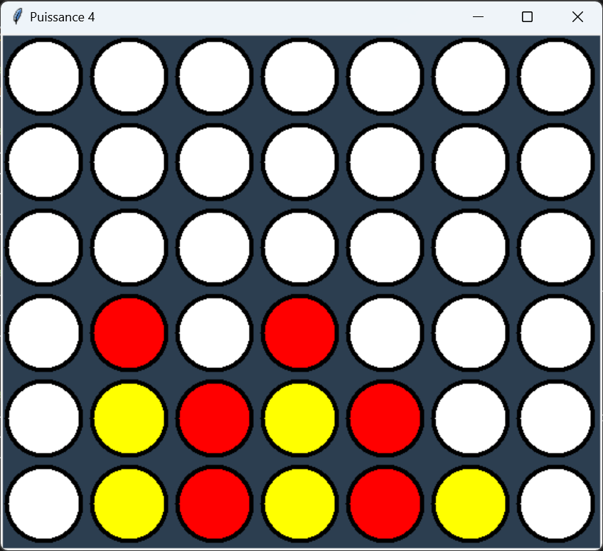

# Puissance-4-IN200

# Carnet de Charges - Puissance 4
## ✅ Description du projet
Le projet consiste en la réalisation d'un jeu de Puissance 4 en Python

## ✅ Fonctionnalités
- [x] Interface graphique interactive.
- [x] Deux joueurs qui s'affrontent.
- [x] Placement des jetons.
- [ ] Vérification automatique de la victoire.
- [ ] Enregistrer et charger une partie en cours.

## ✅ Équipe
- **Réalisé par :** Anis TOUAT, Adil KORICHI, Ghofrane MAKBOUL, Pierre DETOLLE.
- **Leader :** Anis TOUAT
- **Responsable qualité code :** Pierre DETOLLE

## ✅ Améliorations possibles
- [ ] Menu principal permettant de configurer la partie avant le lancement.
- [x] Fenêtre de victoire annonçant le gagnant.
- [x] Possibilité de recommencer une partie après une victoire.

## Aperçu du jeu
Voici un aperçu du jeu en action :

